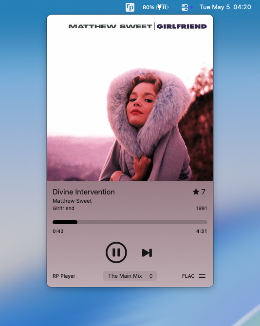
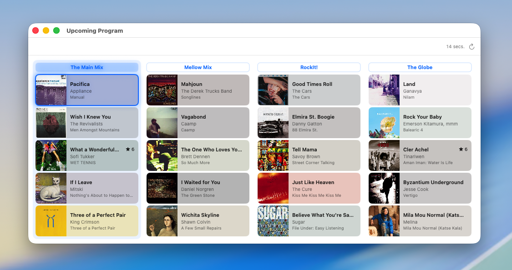
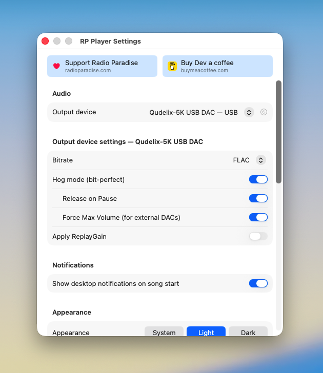

# Radio Paradise bit-perfect macOS player

Optimized for macOS 14+

[Download the latest RP Player release](https://github.com/gvajda/rp-player/releases/latest)

   

## Summary

My goal was a tiny menu-bar [Radio Paradise](https://radioparadise.com/) player for macOS that actually plays the streams — bit-perfect to my DAC — and stays out of the way. The app drives the same `api/play` endpoint the official web player uses, so the channel order, song boundaries, and listener cursor match the web/mobile experience. Decoding goes through libmpv; output goes through CoreAudio in hog (exclusive) mode so other apps don't get to resample what reaches the DAC.

> **Disclaimer**\
> This is not an official Radio Paradise product. The Radio Paradise name and logo are owned by Radio Paradise. All displayed metadata and audio streams come from the public Radio Paradise REST API.

<p align="center"></p>

## Getting started

The app ships as a notarisation-free `.app` bundle. Download `RP Player-<version>.dmg` from the [Releases](https://github.com/gvajda/rp-player/releases/latest) page, open the DMG, and drag `RP Player.app` into the `Applications` shortcut.

**First launch:** macOS Gatekeeper blocks apps that aren't notarised. Right-click `RP Player.app` in Finder and choose **Open**, then confirm. Or, from a terminal:

```sh
xattr -dr com.apple.quarantine "/Applications/RP Player.app"
open "/Applications/RP Player.app"
```

The app installs a status item in the menu bar (no Dock icon, no main window). Click the icon to open the mini player; right-click for the context menu. On first run all settings are at defaults (FLAC bitrate, hog mode on, system appearance) — no setup required to start listening.

**Keychain prompt on launch (after first sign-in):** once you've signed in (Settings → Sign In), your session cookies are stored in the macOS Keychain. Because the released `.app` is self-signed (not codesigned with a stable Apple Developer identity), macOS asks "RP Player wants to access [item] in your keychain" on every launch from then on — click **Always Allow** to suppress it for that build. A new release replaces the signing identity, so the prompt returns once after each upgrade. First-ever launch (before sign-in) is silent.

## Features

### Radio Paradise Playback

- **Plays every Radio Paradise channel**
  - Channel list fetched live from `api/list_chan`; new/removed channels appear automatically.
  - ⭐ Includes the **My Paradise** (a.k.a. Favorites) channel once you log in.

- **Every bitrate the API offers**
  - 32k / 64k / 128k / 320k AAC, 128k / 320k MP3, FLAC.
  - Selectable from Settings; takes effect on the next channel switch or block boundary.

- **Song rating**
  - Click ☆ to rate songs, or see your rating (★ N) displayed in the title row. Disabled when signed out. Ratings POST to `api/rate` and update the local `userRating` immediately on success.
  - Click on a notification in the Notification Center to rate a song played in the past.
  - Sign in via Settings → Sign in. The login window is a `WKWebView` pointed at the official login page; the auth cookies stay in the macOS Keychain.

- **Behaviour matches the official player**
  - Bootstrap and advance both go through `api/play` with the personalised per-listener cursor, so the same blocks/songs play in the same order as the web player.
  - Cross-session resume: the backend remembers where you left off per channel. Restarting the app picks up where you stopped.
  - Telemetry endpoints (`update_history`, `update_pause`) keep the cursor accurate across pauses, skips, and song boundaries.

- **⭐ Extra: Upcoming Program window**
  - Side-by-side columns, one per channel, each showing the next N songs (configurable in Settings).
  - Each card has the album art, title, artist, album, and your personal rating if any.
  - The currently playing channel's column is tinted with the accent colour and its title carries a glow.
  - The currently playing song row gets an accent-colour border + glow if it's still in the loaded slice; if the data is stale the column highlight stays but the row glow doesn't appear.
  - **Channel headers are clickable** — switching from this window changes the channel in the popover and on the engine. Songs are not interactable; pause/skip stay in the popover.
  - Refresh button in the toolbar; "last updated" relative timestamp; channel filter for hiding channels you never browse (chan 42 + 99 are always excluded).
  - Uses `api/play` (not `api/get_block`) so the upcoming list reflects the same personalised cursor as actual playback.

<p align="center"></p>

### Audio

- **Media keys + Control Center widget**
  - Hardware **Play/Pause** and **Next Track** keys on Mac and Bluetooth keyboards control the stream.
  - macOS **Now Playing** widget (Control Center, lock-screen-style controls) shows current title/artist/album/artwork plus elapsed time, and reflects play/pause state.
  - Previous-track and seek are intentionally disabled — Radio Paradise is forward-only.

- **Per-device audio settings**:
  - Each output device stores its own profile (hog mode, release-on-pause, force-max volume, ReplayGain, bitrate).
  - Switching devices instantly restores that device's saved profile. Devices seen for the first time start from safe defaults — all toggles off, 320k AAC — so a DAC profile with Force Max Volume on can never bleed over to built-in speakers.

- **Bit-perfect output via CoreAudio hog mode**
  - The app acquires the audio device exclusively (`kAudioDevicePropertyHogMode`) and feeds it the decoded sample stream untouched — no system mixer, no resampling.
  - Hog mode is opt-out in Settings if you'd rather share the device with other apps.
  - **Release on Pause** (default on): the device returns to shared use whenever you pause, so other apps and Mac calls work normally without quitting RP Player.
  - **Force Max Volume** (for external DACs): pins the device's CoreAudio volume to 100% and locks `volume-max` so no software attenuation is in the signal path. Confirmation alert before enabling — set your DAC/amp/headphone volume first.

- **Apply ReplayGain**
  - Per-track loudness normalisation when on, untouched audio when off.
  - default off; force-max overrides it.

<p align="center"></p>

### Visuals

- **Mini player popover**
  - Album art at the top of the panel, edge-to-edge.
  - Title / artist / album, current rating (★ N), live elapsed/remaining and a progress bar that updates per second.
  - Playback control: play–pause + skip-forward (skip respects the per-block song list and falls through to the prefetched next block).
  - Channel picker centred under the controls; bitrate label to the right (verbatim from the API: "FLAC", "320k AAC", etc.).
  - Hamburger menu with: Settings, Open Song in Browser, Upcoming Program, Floating Window, About, Quit.

- **Floating window mode**
  - Toggle from the menu (right-click icon or in-popover hamburger). Item shows a checkmark when active.
  - The popover detaches from the menu-bar anchor: stays visible across other-app interactions, joins all Spaces, and is draggable from any background area.
  - Click anywhere to dismiss is disabled; toggle off (or close from the icon click) returns it to anchored mode.
  - Setting persists across launches — turn it on once, the panel comes back on the next start.

- **Album art + ambient background**
  - Album art is fetched from `img.radioparadise.com`, validated as a real image, and cached on disk (LRU, ~10 MB cap).
  - The next song's art is **prefetched** as soon as it's known (within-block from the song list, across blocks from the prefetched next block), so the cover swap at song boundaries is instant — no blank tile.
  - Optional **ambient background**: samples a representative colour from the bottom edge of the cover and fades the popover background between that colour and the system window colour. Toggle in Settings.

- **Appearance Setting**
  - System / Light / Dark mode picker.
  - **Popover style** picker (None / Ambient / Frosty): None is the default opaque window background, Ambient paints a 2-stop gradient sampled from the current album art, Frosty drops a `NSVisualEffectView` (`.hudWindow`, `.behindWindow`) behind the SwiftUI host so the desktop blurs through.
  - **Frosted Upcoming Program window** — same `NSVisualEffectView` blur behind the upcoming-cards layout (macOS 14+).

- **Notifications**
  - One macOS notification per song change (banner + tray entry) with cover thumbnail.
  - Clicking a notification:
    - For the currently playing song → opens the popover.
    - For a song that finished playing recently → opens a small "past song" panel with the same metadata + rating row, so you can rate a track you only noticed after it ended.
  - Toggle in Settings; needs the system notification permission granted on first launch.

- **Hover tooltip on the menu-bar icon**
  - Hovering the icon (after a 300 ms delay) shows a two-line tooltip: "RP Player" plus a live `-mm:ss` countdown to the end of the current song.
  - The countdown ticks every second while the cursor stays over the icon. No song playing → second line hidden.

- **Right-click context menu**
  - Same items as the in-popover hamburger menu (sourced from one shared NSMenu builder).
  - "Open Song in Browser" auto-disables when nothing is playing.
  - "Upcoming Program…" opens the schedule window described below.
  - "Floating Window" toggles the popover into draggable always-on-top mode (see below).

## Under the hood

- **Audio pipeline**
  - **Decoder:** libmpv 0.36.0, vendored under `Vendor/libmpv/` (universal binaries via `media-kit/libmpv-darwin-build`).
  - **Output:** mpv's plain `coreaudio` AO. The app does not use `coreaudio_exclusive` — it opens hog mode itself via `AudioObjectSetPropertyData` on `kAudioDevicePropertyHogMode` *before* mpv opens the device, then hands the device back on shutdown. This avoids the format-negotiation failures observed on USB DACs (e.g. Qudelix-5K) when mpv tries to own exclusive mode itself.
  - **Block-cued seek:** `loadfile <url> replace start=<seconds>` for the initial cue, instead of a post-`fileLoaded` seek, so the UI doesn't briefly show the cue position while the HTTP buffer is still catching up.

- **Resilience**
  - mpv occasionally fails to decode a block (e.g. some short promo `.m4a` files return `MPV_ERROR_NOTHING_TO_PLAY`). Instead of stalling the channel, the app advances past the bad block via `api/play` and tries the next one, up to a small retry budget. The cursor moves forward, the listener doesn't get stuck.
  - Reliable handoff when another app is already using the speaker. If a YouTube tab (or anything else) is feeding the audio device when you press play, the app claims hog mode *before* mpv opens the device, so playback starts cleanly the first time instead of going silent until you toggle pause.
  - Live sync when a device disappears. Unplug your USB DAC mid-listening and the app notices, drops hog mode and force-max for hearing safety, and clears the device selection so the Settings panel reflects reality. Plug the DAC back in and pick it again — your saved per-device profile (hog / force-max / ReplayGain / bitrate) is restored automatically.
  - Stale-bootstrap recovery: when the listener has been idle long enough that the server's per-`(player_id, chan)` cursor has lagged real-time, `api/play?action=start` can return a block whose audio file already finished broadcasting (encoded as `cue=0` with all song offsets non-positive and at least one strictly negative). Naively playing that file would resurrect already-aired content while the UI latched onto a song that never matched the audio. The app detects this signature and follows up with a single `api/play?action=play` advance to fetch the live block; one retry max so the user is never caught in a loop.
  - Long-idle resume refetch: when resuming after a pause of 59 minutes or more, the app refetches the block via the bootstrap path instead of asking mpv to resume the existing stream. The threshold sits just under typical 1-hour CDN/server TCP idle eviction, so the listener never hears mpv hit "stream ends prematurely" on a connection the CDN already closed. Composes with stale-bootstrap recovery — if the refetched block is also stale, the same single advance retry kicks in.

### Optimized performance

A menu-bar app should disappear into the background. RP Player aims for a ~4% avg / ~7% max single CPU core footprint and an ~80 MB RAM ceiling (measured on an M1 laptop during active FLAC playback).

- **mpv position events at 1 Hz, not 10–25 Hz.** mpv's `time-pos` property is observed as `MPV_FORMAT_INT64` instead of `MPV_FORMAT_DOUBLE`, so the engine only emits a tick when the whole-second value changes. The progress bar, OS Now Playing widget, and song-boundary detection all run off the same low-rate stream.

- **HTTP demuxer buffers sized for radio, not video.** mpv's defaults (~150 MB forward buffer, ~75 MB backward) are tuned for video scrubbing. RP Player caps them at 8 MiB / 1 MiB with a 10-second cache window — plenty for a live audio stream that is never rewound.

- **Idle pump wakeups minimized.** The libmpv event pump uses a 5-second wait timeout (vs. the original 0.5 s) so an idle / paused player nearly never wakes the CPU; shutdown still calls `mpv_wakeup` so quitting is instant.

### Cookie-based authentication

If you sign in, the app stores the same session cookies your browser stores after a Radio Paradise login (`C_username`, `C_passwd`, `C_validated`, plus the session/PHPSESSID cookies needed by `api/rate`). Storage is the macOS Keychain.

> [!NOTE]
> The app **does not store or log your password**. Only the cookies the browser sets are kept. Logging out from Settings deletes them.

### Files on disk

`~/Library/Application Support/RP Player/` contains:

- `config.json` — user-visible settings (selected channel, appearance, ambient toggle, upcoming row count, hidden channels, floating-window state, output device UID, etc.) plus an `audioProfiles` map keyed by device UID that stores per-device audio settings (hog mode, release-on-pause, force-max volume, ReplayGain, bitrate). Editing this file by hand is equivalent to changing the setting via the UI.
- `Logs/RPPlayer.log` — rotating log file (info-level by default; flip "Verbose logging" in Settings for full coordinator/engine traces).
- `AlbumArtCache/` — covers indexed by SHA-256 of the cover path. Capped at 100 files / 10 MB; oldest evicted on every write.

The Keychain account/service used for cookies is `com.gvajda.rpplayer`. Removing the app does not delete the keychain entry — use Settings → Sign out to clear it.

## About the project

Hobby project, deliberately small and macOS-native. Used to learn

- Swift 6 strict concurrency (actors, `@MainActor`, sendable closures, async streams)
- AppKit + SwiftUI interop (status item, borderless `NSPanel` panels hosting SwiftUI views)
- libmpv via the Swift C-interop layer
- CoreAudio HAL (device enumeration, hog-mode acquisition, format probing)
- the Radio Paradise REST API (block fetch, telemetry, info, rating)

This project supersedes the Windows tray app [RP_Notify](https://github.com/gvajda/radio-paradise-song-notification). Scope and architecture differences live in `docs/LEGACY.md`. The full design spec is `docs/DESIGN.md`.

### Build from source

Requires Xcode 16 / Swift 6.2 on macOS 14+.

```sh
swift build
swift test
swift run RPPlayer       # raw process; status item appears in the menu bar
scripts/make-app.sh      # produces a signed RP Player.app bundle
```

## Support development

If you find RP Player useful, you can support continued development:

[](https://buymeacoffee.com/gvajda)

Please also consider [donating to Radio Paradise](https://radioparadise.com/donate) — they're the ones running the listener-supported station this app plays.

## License

MIT — see [`LICENSE`](LICENSE).
